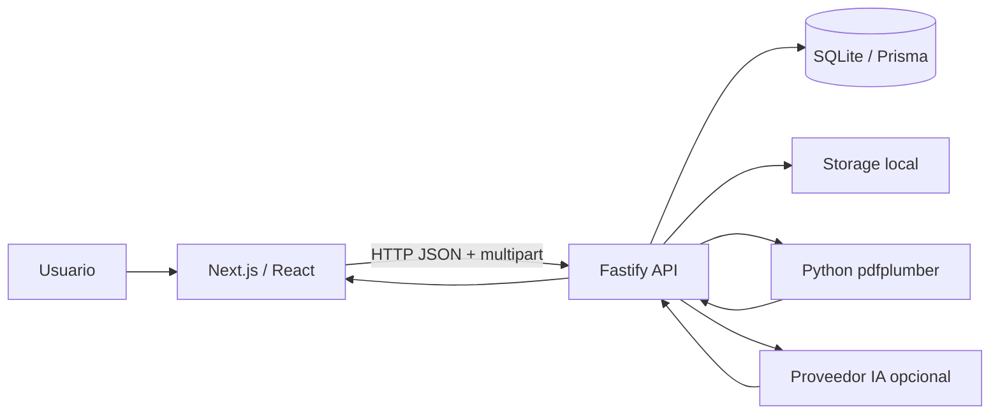

# CajaApp V3 — Blueprint técnico y funcional integral

> Documento único de reconstrucción del repositorio `sebacorby/cajaApp-V3`.
>
> **Fecha de relevamiento:** 2026-07-30  
> **Rama relevada:** `main`  
> **Commit base relevado:** `a3bb657cfd74bdf90e7ac0d7d79211c3deab27e4`  
> **Idioma de producto:** español, con formato regional `es-AR`  
> **Propósito de este archivo:** permitir que una persona o agente que no tenga contexto previo pueda comprender, ejecutar y reconstruir CajaApp V3 con la mayor fidelidad posible.

---

## 1. Resumen ejecutivo

CajaApp V3 es una aplicación local de finanzas personales orientada a consolidar ingresos, movimientos bancarios, consumos de tarjetas, cuotas futuras, presupuestos, objetivos, cierres mensuales y análisis financiero. Su objetivo no es reemplazar al banco ni ejecutar decisiones financieras, sino darle al usuario una representación explicable, corregible y trazable de su realidad financiera.

La aplicación se apoya en cuatro ideas centrales:

1. **Local-first:** la base principal es SQLite y los documentos se guardan en almacenamiento local. No existe una conexión automática a cuentas bancarias.
2. **Control humano:** todo documento importado pasa por un borrador o vista previa antes de consolidarse. El usuario puede revisar, corregir, aceptar, revertir, archivar o eliminar.
3. **Trazabilidad:** el sistema conserva documento original, hash, borrador, versión aceptada, filas persistidas, eventos derivados y estados históricos.
4. **Determinismo financiero:** los cálculos y las importaciones activas de recibos de sueldo y resúmenes de tarjeta no dependen de una respuesta probabilística de IA. La infraestructura de IA sigue documentada y disponible, pero el camino activo de producto usa parsers programáticos con diagnósticos y fallo cerrado.

La solución está dividida en dos aplicaciones Node independientes:

- `workspace/backend`: API Fastify, lógica financiera, Prisma/SQLite, importación de documentos, parsers, IA, backups y servicios de dominio.
- `workspace/frontend`: aplicación Next.js/React, navegación lateral, paneles financieros, formularios de revisión y visualizaciones.

No hay un `package.json` monorepo en la raíz que gobierne ambos paquetes. Backend y frontend se instalan, compilan y prueban por separado. Los scripts de la raíz coordinan la ejecución local en Windows.

---

## 2. Propósito del producto

### 2.1 Problema que resuelve

Una persona suele tener información financiera fragmentada entre recibos de sueldo, extractos bancarios, resúmenes de distintas tarjetas, cuotas futuras, gastos manuales y objetivos de ahorro. CajaApp unifica esas fuentes en un modelo local y permite responder preguntas como:

- cuánto dinero real ingresó este mes;
- qué ingresos son estimados y cuáles están confirmados;
- cuánto corresponde pagar por cada tarjeta;
- qué cuotas se arrastran a meses futuros;
- qué movimientos están duplicados o representan el mismo hecho financiero;
- cuánto se gastó por categoría;
- si un presupuesto fue excedido;
- cuál es la salud financiera del período;
- qué información quedó cerrada y respaldada.

### 2.2 Principios de producto

- **Los importes reales prevalecen sobre estimaciones.**
- **Una misma realidad financiera debe mostrarse una sola vez.** Un recibo, su evento de ingreso y su proyección son representaciones relacionadas, no tres ingresos independientes.
- **La eliminación debe respetar el ciclo de vida completo.** Cuando el usuario elimina una fuente salarial, se eliminan en una operación los recibos, eventos, borradores y documentos huérfanos vinculados.
- **Las proyecciones deben identificarse como estimadas.** No se presentan como hechos consumados.
- **Las fuentes originales no se destruyen al conciliar.** La conciliación decide qué representación se cuenta, pero no borra arbitrariamente los registros origen.
- **Los documentos nunca se aceptan silenciosamente.** Primero se crea un borrador revisable.
- **El parser debe fallar de forma explícita cuando no puede explicar una línea financiera.** No debe inventar datos para “hacer pasar” un documento.
- **La IA no es autoridad contable.** Puede extraer o explicar, pero los resultados se validan contra contratos y requieren aceptación humana.

### 2.3 No objetivos

CajaApp V3 no pretende:

- conectarse a home banking ni operar cuentas;
- realizar transferencias, pagos o inversiones;
- sustituir una liquidación laboral oficial;
- producir asesoramiento financiero profesional vinculante;
- almacenar dinero ni credenciales bancarias;
- usar OCR como estrategia principal para PDFs que ya contienen texto;
- ocultar diferencias o inconsistencias para obtener una importación “exitosa”.

---

## 3. Arquitectura de alto nivel



### 3.1 Topología de ejecución

En ejecución local coordinada por los launchers de la raíz:

- backend: `127.0.0.1:11436` por defecto en `start-cajaapp.ps1`;
- frontend: `127.0.0.1:11437` por defecto en el mismo launcher;
- Ollama local, si se usa: `127.0.0.1:11434` por defecto;
- SQLite: archivo local indicado por `DATABASE_URL`;
- documentos: directorio local indicado por `STORAGE_DIR`;
- extracción PDF: proceso Python hijo ejecutado por el backend.

Si el backend se inicia directamente sin el launcher, su configuración interna usa por defecto `HOST=127.0.0.1` y `PORT=4000`. El frontend debe apuntar al puerto elegido mediante `NEXT_PUBLIC_API_BASE_URL`.

### 3.2 Comunicación

- Frontend y backend se comunican por HTTP.
- Los documentos se envían como `multipart/form-data`.
- Las respuestas de dominio son JSON.
- CORS está habilitado con credenciales para el entorno local.
- Fastify limita el tamaño de upload con `MAX_UPLOAD_BYTES`.
- El frontend usa `cache: "no-store"` en consultas que deben reflejar el estado actual.

### 3.3 Persistencia

La persistencia tiene dos capas:

1. **SQLite mediante Prisma:** metadatos, borradores, filas, movimientos, ingresos, conciliaciones y resultados.
2. **Sistema de archivos:** PDFs, respuestas crudas de IA, backups y otros artefactos que no conviene guardar como BLOB en SQLite.

Cada documento cargado recibe SHA-256. El hash se usa para idempotencia, deduplicación y trazabilidad.

---

## 4. Estructura del repositorio

```text
cajaApp-V3/
├─ README.md
├─ APPCAJA-V3-BLUEPRINT-TECNICO-FUNCIONAL.md   # este documento
├─ workspace/
│  ├─ backend/                                  # API y dominio
│  ├─ frontend/                                 # aplicación web
│  └─ shared/                                   # reservado; actualmente mínimo
├─ contracts/
│  ├─ prompts/                                  # prompts versionados
│  ├─ schemas/                                  # contratos JSON
│  └─ examples/                                 # ejemplos contractuales
├─ docs/                                        # documentación viva y evidencia mínima
├─ architecture-handoff/                        # intercambio arquitecto/agentes
├─ features/                                    # especificaciones por vertical
├─ specs/                                       # especificaciones generales
├─ runtime/                                     # artefactos de ejecución local
├─ start-app.py
├─ start-cajaapp.ps1
├─ cajaapp-headless-up.ps1
├─ cajaapp-headless-down.ps1
├─ run-playwright.ps1
└─ scripts auxiliares .bat/.vbs/.sh
```

### 4.1 Qué es fuente de verdad

- El código ejecutable está bajo `workspace/`.
- La base de datos autoritativa es la definida por `workspace/backend/prisma/schema.prisma`.
- Los contratos IA autoritativos están bajo `contracts/`.
- `architecture-handoff/` contiene órdenes y evidencias de trabajo; no forma parte del runtime.
- Archivos con sufijos `.base.ts`, `.legacy.tsx`, `.before-...`, `.replaced-...` o respaldos similares existen para compatibilidad, rollback o trazabilidad. No deben asumirse activos sin revisar qué archivo los importa.
- Reportes Playwright, salidas `.out/.err` y resultados históricos no son código fuente.

---

## 5. Stack tecnológico

## 5.1 Backend

| Área | Tecnología | Versión de referencia | Uso |
|---|---|---:|---|
| Runtime | Node.js | entorno validado con Node 24.18.0; tipos Node 22 | servidor, workers y scripts |
| Lenguaje | TypeScript | 5.7.x | dominio y API |
| Framework HTTP | Fastify | 5.2.1 | rutas, hooks, errores y plugins |
| Validación | Zod | 3.24.x | esquemas de entrada y contratos internos |
| ORM | Prisma Client | 6.5.x | acceso a SQLite y transacciones |
| Base de datos | SQLite | vía Prisma | persistencia local |
| Logging | Pino / pino-pretty | 9.6 / 13 | logs estructurados y desarrollo |
| PDF Node | pdfjs-dist | 4.10.x | utilidades PDF |
| Imagen/PDF | pdf2pic + canvas | 3.1 / 3.1 | soporte de render/visión cuando corresponde |
| Hash/cifrado | `node:crypto` y CryptoJS | nativo / 4.2 | SHA-256 y utilidades criptográficas |
| Pruebas | Vitest | 3.0.x | unitarias e integración |
| Dev runner | TSX | 4.19.x | ejecución TypeScript en desarrollo |
| API docs | Swagger + Swagger UI | plugins Fastify | documentación HTTP |

Scripts principales de `workspace/backend/package.json`:

```bash
npm run dev
npm run build
npm start
npm test
npm run test:watch
npm run prisma:generate
npm run prisma:migrate
npm run prisma:migrate:deploy
npm run prisma:studio
npm run prisma:status
npm run check
```

`npm run check` ejecuta build y tests.

## 5.2 Frontend

| Área | Tecnología | Versión de referencia | Uso |
|---|---|---:|---|
| Framework | Next.js | 16.1.x | App Router y build standalone |
| UI runtime | React / React DOM | 19.x | componentes y estado |
| Lenguaje | TypeScript | 5.x | tipado de UI y API |
| Estilos | Tailwind CSS | 4.x | sistema de utilidades y tokens |
| Componentes | Radix UI + patrón shadcn | versiones del lockfile | primitivas accesibles |
| Iconografía | Lucide React | 0.468.x | iconos consistentes |
| Formularios | React Hook Form | 7.54.x | formularios complejos |
| Validación cliente | Zod | 4.x | contratos de formularios |
| Datos remotos | TanStack Query | 5.90.x | consultas y mutaciones |
| Tablas | TanStack Table | 8.20.x | listados extensos |
| Gráficos | Recharts | 2.15.x | visualizaciones financieras |
| Animación | Framer Motion | 12.23.x | transiciones controladas |
| Fechas | date-fns | 4.1.x | cálculo y presentación |
| Toasts | Sonner | 2.0.x | feedback de operaciones |
| Tema | next-themes | 0.4.x | claro, oscuro y sistema |
| E2E | Playwright | 1.61.x | pruebas de navegador |

Scripts principales de `workspace/frontend/package.json`:

```bash
npm run dev
npm run typecheck
npm run lint
npm run build
npm start
npm run test:e2e
```

El build frontend:

1. ejecuta typecheck;
2. ejecuta `next build`;
3. copia `.next/static` y `public` al bundle standalone.

`next.config.ts` usa `output: "standalone"` y permite orígenes de desarrollo `127.0.0.1` y `localhost` para que Playwright no bloquee recursos de hidratación.

## 5.3 Python

La extracción de texto PDF utiliza:

```text
pdfplumber==0.11.10
```

Archivo ejecutado:

```text
workspace/backend/python/pdf_to_raw.py
```

El script:

- abre el PDF con pdfplumber;
- extrae texto página por página;
- normaliza saltos de línea;
- inserta marcadores `--- PAGE n / total ---`;
- informa páginas con y sin texto;
- calcula SHA-256 del texto crudo;
- devuelve JSON por stdout;
- devuelve errores también como JSON y código de salida distinto de cero.

## 5.4 IA

Proveedores soportados por la infraestructura:

- Ollama local o cloud-compatible;
- proveedor OpenAI-compatible;
- MiniMax para adaptaciones específicas;
- modo mock para pruebas.

La IA es opcional para el funcionamiento financiero básico. El importador determinístico de tarjetas y recibos no requiere un LLM.

---

## 6. Diseño visual y sistema de estilos

## 6.1 Identidad

La identidad visual comunica estabilidad, privacidad y crecimiento. La paleta central es verde esmeralda con fondos cálidos en modo claro y verdes casi negros en modo oscuro.

Principios visuales:

- tarjetas con radios amplios (`rounded-xl`, `rounded-2xl`);
- jerarquía clara entre valor real, valor estimado y metadatos;
- números con `tabular-nums`;
- bordes sutiles y baja saturación;
- acciones primarias en esmeralda;
- destructivas en rojo controlado;
- espacios amplios y bloques compactos;
- evitar repetir la misma información en distintas capas visibles.

## 6.2 Tokens principales

`workspace/frontend/src/app/globals.css` define tokens OKLCH para:

- background y foreground;
- card y popover;
- primary, secondary, muted y accent;
- destructive, border, input y ring;
- cinco colores de gráficos;
- sidebar completo;
- radios `sm`, `md`, `lg`, `xl` derivados de `--radius: 0.875rem`.

Modo claro:

- fondo cálido tipo papel;
- tarjetas blancas;
- texto verde oscuro;
- primario esmeralda profundo.

Modo oscuro:

- fondo casi negro con matiz verde;
- tarjetas verde oscuro;
- primario esmeralda luminoso;
- bordes blancos con baja opacidad.

Paleta de gráficos:

1. esmeralda;
2. teal;
3. ámbar;
4. rosa;
5. violeta.

## 6.3 Tipografía y accesibilidad

- Fuente sans y mono provistas por el setup de Next/Geist.
- `antialiased` en `body`.
- features tipográficas para mejor lectura numérica.
- foco visible mediante `ring`.
- navegación con `aria-current`, `aria-label`, títulos descriptivos y botones semánticos.
- componentes Radix para diálogos, menús, tabs, tooltips, select, progress y popovers.
- los componentes relevantes exponen `data-testid` para validación.

## 6.4 Responsive

La aplicación usa un shell con:

- sidebar persistente en escritorio;
- navegación adaptable en viewport pequeño;
- header superior;
- área principal con ancho y padding responsivos;
- grids que pasan de una a varias columnas según breakpoints;
- tablas y detalles con scroll cuando no es posible compactar.

## 6.5 Convención UX

- Mostrar el resumen primero y el detalle después.
- Una acción principal por bloque.
- Las tareas complejas, como importar, se abren sólo cuando el usuario inicia esa tarea.
- Estados vacíos explican qué falta y ofrecen la siguiente acción.
- Errores se muestran junto al flujo que falló.
- El usuario debe distinguir siempre `real`, `estimado`, `proyectado`, `archivado`, `resuelto` y `histórico`.

---

## 7. Arquitectura frontend

## 7.1 Entrada

`workspace/frontend/src/app/page.tsx` es un componente cliente que compone:

```tsx
<AppShell>
  <SectionRouter />
</AppShell>
```

`layout.tsx` aplica:

- estilos globales;
- `AppPreferencesProvider`;
- `Toaster`;
- metadata en español.

## 7.2 Navegación

`SectionRouter` no usa una ruta URL por cada sección. Lee la sección activa desde el store financiero y renderiza el componente correspondiente. Antes del contenido monta `SearchTargetBanner`, que conserva el contexto cuando se navega desde una búsqueda o conciliación hacia un registro concreto.

Grupos de navegación definidos en `src/lib/finance/nav.ts`:

### Operación

- Inicio;
- Movimientos;
- Ingresos;
- Tarjetas;
- Pagos de tarjeta.

### Ingesta y calidad

- Importaciones;
- Conciliación.

### Planificación

- Presupuestos;
- Objetivos.

### Análisis

- Reportes;
- Salud financiera;
- Asesor IA.

### Sistema

- Cierres;
- Respaldo;
- Configuración.

## 7.3 Organización de componentes

```text
src/components/finance/
├─ alerts/
├─ categories/
├─ charts/
├─ dashboard/
├─ financial-health/
├─ goals/
├─ imports/
├─ layout/
├─ preferences/
├─ search/
├─ sections/
├─ states/
└─ transactions/
```

`src/components/ui/` contiene primitivas reutilizables compatibles con el patrón shadcn/Radix.

`src/lib/finance/` contiene:

- clientes API por dominio;
- formateo monetario;
- presentación derivada;
- navegación;
- store de UI;
- contratos compartidos del cliente.

## 7.4 Estado de UI

El store de UI conserva, como mínimo:

- sección activa;
- navegación hacia resultados con `recordId`, `recordType`, módulo, título y contexto;
- cierre del banner de destino;
- preferencias de visualización.

El estado financiero permanente no vive en el frontend. Se vuelve a solicitar al backend después de mutaciones importantes.

## 7.5 Preferencias locales

El modelo `LocalAppSettings` incluye:

- nombre visible;
- locale;
- zona horaria;
- moneda predeterminada;
- tema;
- ocultar importes.

Valores predeterminados actuales:

```text
displayName: Javi
locale: es-AR
timezone: America/Argentina/Tucuman
defaultCurrency: ARS
theme: system
hideAmounts: false
```

---

## 8. Arquitectura backend

## 8.1 Composición del servidor

`buildApp()` crea Fastify y registra:

- CORS;
- multipart;
- handler central de errores;
- health;
- cards;
- imports;
- import-center;
- reconciliation;
- manual-purchases;
- incomes;
- movements;
- debit-imports;
- dashboard;
- future;
- reports;
- settings;
- goals;
- budgets;
- global-search;
- financial-health;
- ai-advisor;
- salary-receipts;
- month-close;
- backup-restore.

## 8.2 Patrón por módulo

La estructura típica es:

```text
<module>/
├─ <module>.routes.ts
├─ <module>.controller.ts
├─ <module>.service.ts
├─ <module>.schemas.ts
├─ <module>.types.ts
└─ *.test.ts
```

Responsabilidades:

- `routes`: prefijo y registro del plugin;
- `controller`: HTTP, parsing de parámetros, códigos de estado;
- `schemas`: validación Zod;
- `service`: transacciones y reglas de dominio;
- `types`: contratos internos;
- `mapper/presentation`: adaptación DB ↔ API;
- tests: invariantes y regresiones.

## 8.3 Errores

- `AppError` conserva status HTTP y detalles de dominio.
- errores de validación producen 400;
- recursos inexistentes producen 404;
- conflictos de dominio pueden producir 409;
- errores inesperados producen 500;
- en producción no se expone el stack ni información interna.

## 8.4 Inicio y apagado

`main.ts`:

1. instala la política de ejecución IA;
2. valida el proveedor de extracción;
3. conecta Prisma;
4. repara enlaces históricos de proyecciones de tarjetas;
5. inicia Fastify;
6. inicia el worker IA si corresponde;
7. escucha SIGTERM/SIGINT;
8. detiene worker, servidor y DB ordenadamente.

## 8.5 Logging

Los logs son estructurados y usan eventos con contexto, por ejemplo:

- recepción de import;
- creación de borrador;
- transición a preview;
- fallo de proveedor;
- aceptación;
- reparación de vínculos;
- eliminación y limpieza de almacenamiento;
- sincronización de conciliación.

No registrar PDFs completos, tokens, claves ni datos personales innecesarios.

---

## 9. Modelo de datos

## 9.1 Convención monetaria

Los importes se guardan como `String`, normalmente con dos decimales, en campos terminados en `Raw`. No deben almacenarse como `Float`.

Motivos:

- preservar exactamente el valor del documento;
- soportar `1.234,56` y `1234.56`;
- evitar errores binarios de JavaScript;
- convertir a centavos con `bigint` para sumar, comparar o prorratear;
- mantener ARS y USD separados.

## 9.2 Documentos y IA

### UploadedDocument

Guarda:

- nombre;
- MIME;
- tamaño;
- SHA-256;
- ruta local;
- páginas;
- timestamps.

Se relaciona con borradores y entidades aceptadas de tarjetas y recibos.

### AiExtractionRun

Guarda trazabilidad completa:

- prompt y hash;
- versión;
- proveedor;
- URL base;
- modelo;
- respuesta cruda y hash;
- JSON resultante;
- errores de validación;
- reintentos;
- estado y duración.

## 9.3 Tarjetas

### CardStatementDraft

Borrador editable asociado a documento y, en el flujo IA, a una ejecución. Contiene preview JSON y relaciones normalizadas a:

- secciones;
- grupos/tarjetas;
- filas.

### CardStatement

Resumen aceptado y versionado. Campos principales:

- período e `historyKey`;
- versión;
- activo para período;
- estado y archivo;
- banco, marca, número, cuenta y titular cuando existen;
- total ARS/USD;
- pago mínimo;
- vencimiento, próximo cierre y próximo vencimiento.

Relaciones:

- secciones;
- grupos;
- filas;
- proyecciones de cuotas;
- compras manuales.

### CardStatementRow

Representa transacción, impuesto, cargo, pago consolidado, total u otra fila. Conserva:

- página;
- sección y grupo;
- fecha cruda e ISO;
- referencia;
- cuota;
- comprobante;
- importes ARS/USD;
- moneda original;
- texto original;
- confianza.

### CardInstallmentProjection

Proyección mensual derivada de una fila o referencia futura. Debe conservar vínculo correcto con `statementId` y `rowId`.

### ManualCardPurchase

Compra ingresada por el usuario con tarjeta, fecha, moneda, importe y cantidad de cuotas.

## 9.4 Ingresos y recibos

### IncomeSource

Fuente recurrente:

- nombre;
- empleador;
- tipo;
- moneda;
- base;
- mes inicial;
- día de pago;
- frecuencia y porcentaje de aumento;
- activa/pausada.

### IncomeEvent

Ajuste o hecho mensual:

- `monthly_override` para un importe real puntual;
- `permanent_change` o equivalente para cambiar base futura;
- ingreso único;
- real o proyectado;
- dedupe key.

### SalaryReceiptDraft / SalaryReceipt

El borrador contiene preview e items editables. El recibo aceptado conserva:

- documento;
- history key y versión;
- período;
- empleador y empleado;
- fecha de pago;
- moneda;
- bruto;
- descuentos;
- neto;
- fuente de ingreso;
- evento real;
- evento de proyección;
- items originales;
- aceptación y reversión.

## 9.5 Movimientos

### MovementCategory y MovementCategoryRule

Categorías configurables con color, icono, reglas por keyword normalizada y prioridad.

### ManualMovement

Movimiento creado por el usuario. Puede ser ingreso o gasto, real o proyectado, con fecha ocurrida, mes efectivo, fuente, categoría, moneda e importe.

### DebitCsvImport / DebitCsvRow

Importación de extracto de débito:

- configuración de delimitador, encoding, fila de cabecera y mapping;
- filas con fingerprint y ordinal de duplicado;
- inclusión/exclusión;
- validación;
- aceptación y reversión.

## 9.6 Planificación y análisis

- `CategoryBudget`: límite por categoría, moneda y rango, con rollover opcional.
- `SavingsGoal`: objetivo de ahorro, fecha, estado y moneda.
- `GoalContribution` y `GoalActivity`: aportes y auditoría.
- `FinancialHealthSnapshot`: resultado determinístico versionado por fórmula y fingerprint de fuentes.
- `AiAdvisorInteraction`: pregunta, contexto, prompt, modelo, respuesta y trazabilidad.

## 9.7 Conciliación

### ReconciliationCase

Caso de posible duplicado o relación:

- fingerprint;
- tipo;
- estado;
- resolución;
- confianza;
- título y razones;
- importe/fecha;
- movimiento excluido;
- `isCurrent`;
- última detección.

### ReconciliationParticipant

Snapshot del participante con:

- rol A/B;
- entity key y type;
- source type e ID;
- movement ID;
- descripción;
- fecha, moneda e importe;
- metadata.

## 9.8 Cierres y backups

- `MonthClose`: snapshot mensual versionado y reversible.
- `MonthCloseActivity`: auditoría de cierre/reapertura.
- `BackupArchive`: archivo portable, SHA-256, manifest y estado.
- `BackupRestoreActivity`: auditoría de validación/restauración.

---

## 10. Catálogo funcional

## 10.1 Inicio

El dashboard presenta una lectura general de ingresos, gastos, compromisos y calidad de datos. Debe derivar cifras del backend, no de constantes cliente.

## 10.2 Movimientos

Vista unificada de:

- ingresos reales;
- movimientos manuales;
- débitos importados;
- consumos de tarjeta;
- pagos;
- movimientos proyectados cuando la vista los solicita.

Funciones:

- filtrar por fecha, tipo, moneda, categoría y origen;
- crear, editar y anular movimientos manuales;
- categorizar;
- navegar al origen exacto;
- excluir movimientos por conciliación sin borrar la fuente.

## 10.3 Ingresos

La pantalla activa es una vista única, sin montar la antigua sección legacy.

Muestra:

- cobrado real del mes;
- próximo estimado;
- cantidad de fuentes activas;
- una tarjeta por sueldo/fuente;
- último neto real y período;
- próximo sueldo estimado;
- meses relevantes con importes distintos de cero;
- extras semestrales separados.

Acciones:

- cargar o reemplazar recibo;
- revisar borrador;
- aceptar;
- eliminar una fuente con cascade completo.

Reglas:

- el neto en mano es el importe real canónico;
- un recibo del mismo período reemplaza la versión activa anterior;
- el mismo PDF puede reimportarse sin error 409;
- borrar una fuente elimina recibos, borradores, eventos y documentos huérfanos asociados;
- un recibo con SAC no convierte el aguinaldo en ingreso mensual recurrente.

### SAC

- se reconoce `SAC`, `S.A.C.`, `aguinaldo` y `sueldo anual complementario`;
- junio y diciembre pueden incluir un componente separado;
- si existe recibo real de SAC, se muestra como `SAC real`;
- si no existe, se crea `SAC estimado`;
- la estimación financiera del neto es 50% del mayor neto mensual proyectado del semestre;
- es una estimación de caja, no una liquidación laboral oficial;
- un recibo exclusivamente de SAC no reemplaza la base mensual;
- un recibo combinado mantiene el total real del mes y depura la base recurrente futura.

## 10.4 Tarjetas

Funciones:

- importar PDF;
- ver progreso;
- revisar borrador;
- corregir fechas, referencias, cuotas e importes;
- aceptar;
- listar versiones;
- activar una versión;
- archivar;
- eliminar;
- consultar trazabilidad;
- ver totales ARS/USD;
- configurar tipo de cambio;
- proyectar cuotas;
- agregar compras manuales;
- consultar pagos confirmados y futuros.

## 10.5 Importaciones

Centro de calidad y seguimiento:

- documentos en proceso;
- borradores listos;
- fallos;
- aceptados;
- reimportaciones;
- errores de parser o proveedor;
- correcciones pendientes.

## 10.6 Conciliación

La conciliación se sincroniza al entrar y reconstruye los casos vigentes.

Funciones:

- pendientes actuales;
- alta confianza;
- hora de sincronización;
- historial;
- abrir cada participante en su registro exacto;
- conservar A, conservar B, contar ambos o descartar relación;
- excluir una representación del conteo sin destruir fuentes.

Un scan exitoso ocurre antes de invalidar casos anteriores. Los casos cuya `lastDetectedAt` es anterior al inicio del nuevo scan pasan a históricos. Si el scan falla, no se vacía la bandeja vigente.

## 10.7 Presupuestos

- límites por categoría;
- rango temporal;
- moneda;
- consumo real;
- saldo disponible;
- rollover opcional;
- estados activos/inactivos.

## 10.8 Objetivos

- meta e importe objetivo;
- moneda;
- fecha objetivo;
- aportes manuales;
- avance;
- completar, cerrar o reabrir;
- historial de actividad.

## 10.9 Reportes

Agregaciones por período, categoría, origen y moneda. Los reportes deben usar datos aceptados y respetar exclusiones de conciliación.

## 10.10 Salud financiera

Fórmula determinística versionada. Los snapshots guardan:

- rango;
- versión de fórmula;
- fingerprint de fuentes;
- resultado JSON;
- fecha.

La misma entrada y versión debe producir el mismo resultado.

## 10.11 Asesor IA

El asesor consume contexto financiero estructurado, no acceso irrestricto a la base. Cada interacción guarda:

- período;
- modo;
- pregunta;
- moneda;
- fingerprint de contexto;
- versión de fórmula de salud;
- prompt y hash;
- proveedor/modelo;
- request y response;
- duración.

Las simulaciones deben estar aisladas: no alteran movimientos ni proyecciones reales.

## 10.12 Cierres

- cerrar un mes;
- guardar snapshot y fingerprint;
- versionar cierres;
- reabrir;
- auditar operaciones.

## 10.13 Respaldo

- generar backup portable;
- guardar manifest, tamaño y SHA-256;
- validar antes de restaurar;
- registrar restauración;
- no reemplazar una DB activa sin validaciones y resguardo previo.

## 10.14 Configuración y búsqueda

Configuración administra preferencias locales y tipo de cambio. La búsqueda global devuelve destinos navegables con sección, tipo, ID, título y contexto.

---

## 11. Ingesta documental: visión general

Todo flujo documental debe separar claramente estas etapas:

```text
archivo original
  → hash y almacenamiento
  → extracción de texto
  → clasificación
  → parser IA o determinístico
  → validación contractual
  → borrador editable
  → aceptación humana
  → entidad versionada
  → movimientos/proyecciones derivados
```

Reglas compartidas:

- aceptar sólo MIME y tamaño permitidos;
- calcular SHA-256 antes de consolidar;
- conservar el documento original;
- persistir texto original por fila/concepto;
- no escribir entidad aceptada antes de validar el borrador;
- ejecutar aceptación dentro de transacción;
- usar history key y versión;
- permitir reversión o eliminación con limpieza de derivados;
- separar errores de extracción, detección, parsing, validación y persistencia.

---

## 12. Solución basada en IA para lectura de documentos

Esta sección documenta la arquitectura IA aunque no sea el camino activo principal para tarjetas y recibos.

## 12.1 Componentes

```text
workspace/backend/src/modules/ai/
├─ ai-extraction.service.ts
├─ ai-processor-worker.ts
├─ ai-provider-context.ts
├─ ai-unrestricted-execution-policy.ts
├─ json-repair.service.ts
├─ ollama-native.client.ts
├─ ollama.client.ts
├─ openai-compatible.client.ts
├─ minimax.client.ts
├─ ollama-vision.adapter.ts
├─ mock-ai-extraction.service.ts
├─ prompt-loader.ts
├─ text-extraction-provider.ts
└─ text-extraction-provider.factory.ts
```

Contratos:

```text
contracts/prompts/cards/
contracts/prompts/salary-receipts/
contracts/prompts/advisor/
contracts/schemas/cards/
contracts/schemas/salary-receipts/
contracts/examples/
```

## 12.2 Flujo IA original

1. Se recibe el PDF.
2. Se crea `UploadedDocument`.
3. Se crea un draft en estado `processing`.
4. Se crea `AiExtractionRun` con prompt, hash, proveedor y modelo.
5. El worker toma trabajos pendientes.
6. El proveedor de texto ejecuta `pdf_to_raw.py`.
7. Se detecta el tipo documental.
8. Se carga prompt versionado y schema esperado.
9. Se envía al modelo.
10. Se recibe contenido y, según proveedor, razonamiento/stream.
11. `json-repair.service` intenta reparar envoltorios o JSON menormente inválido.
12. Se valida estructura y reglas financieras.
13. Si es válido, se persiste preview y draft `preview_ready`.
14. Si falla, se persisten etapa, mensaje, raw response y errores.
15. El usuario corrige y acepta.

## 12.3 Worker y recuperación

El worker usa:

- polling configurable;
- heartbeat;
- timeout de job;
- detección de trabajos stale;
- reintentos;
- shutdown ordenado.

La telemetría puede incluir:

- inicio;
- último heartbeat;
- modelo;
- fase `connecting`, `streaming` o `completed`;
- chunks;
- caracteres de contenido y reasoning;
- duración;
- páginas y caracteres extraídos.

## 12.4 Proveedores

### Ollama

- `local-proxy`: endpoint local;
- `cloud-direct`: endpoint compatible remoto;
- modelo, contexto, keepalive, streaming, structured output y timeout configurables.

### OpenAI-compatible

Configurable por:

- base URL;
- path de chat completions;
- API key;
- modelo;
- temperatura;
- máximo de output;
- parámetro de tokens;
- response format.

### MiniMax y visión

Existen adaptadores para escenarios de visión o proveedor específico. No convertirlos en requisito del importador determinístico.

## 12.5 Ventajas de IA

- puede adaptarse a layouts no previstos;
- puede inferir encabezados semánticos;
- ayuda con documentos desordenados;
- es útil para explicación y clasificación inicial.

## 12.6 Riesgos de IA

- alucinación de importes o conceptos;
- omisión silenciosa de filas;
- dependencia de red/modelo;
- diferencias entre versiones;
- latencia y timeout;
- JSON inválido;
- costo;
- exposición de datos si se configura un proveedor externo.

## 12.7 Estado actual del producto

### Tarjetas

El importador IA de tarjetas está deshabilitado como camino activo. `imports.service.ts` libera drafts IA antiguos en `processing` y los marca como fallidos con código:

```text
LEGACY_AI_CARD_IMPORT_DISABLED
```

Todo nuevo import de tarjeta pasa por `deterministicImportsService`.

### Recibos de sueldo

El código de extracción IA y compatibilidad histórica se conserva, pero la admisión activa utiliza `deterministic-salary-receipt-import.service.ts` y el registro de parsers determinísticos.

### Asesor

El Asesor IA sí es una funcionalidad activa y separada. No debe confundirse con el parser documental.

## 12.8 Cómo reactivar IA sin romper el producto

No reemplazar directamente el deterministic parser. Implementar una estrategia explícita:

```text
deterministic-first
  → si unsupported y usuario autoriza
  → AI fallback
  → preview marcado como AI
  → revisión humana obligatoria
```

Requisitos:

- conservar `parserId`/provider/model;
- marcar origen IA en el draft;
- nunca aceptar automáticamente;
- comparar totales y cobertura;
- persistir raw response;
- agregar pruebas con fixtures anonimizados;
- no enviar PDFs a proveedor externo sin configuración consciente del usuario.

---

## 13. Solución determinística para resúmenes de tarjeta

## 13.1 Camino activo

Archivos principales:

```text
workspace/backend/src/modules/card-import/
├─ deterministic-imports.service.ts
├─ card-statement-parser.ts
├─ card-statement-parser.types.ts
├─ adaptive-card-statement.parser.ts
├─ adaptive-card-statement.postprocess.ts
├─ galicia-visa.parser.ts
├─ galicia-mastercard.parser.ts
└─ tests y fixtures
```

`imports.service.ts` es una fachada que:

- cierra drafts IA legacy;
- administra reimportación exacta;
- delega al servicio determinístico;
- restaura estados anteriores si la nueva importación falla.

## 13.2 Selección estructural

No se selecciona parser por nombre de banco, emisor o marca.

El parser adaptativo puntúa evidencia:

- total/saldo del resumen: +3;
- vencimiento: +2;
- cierre/ciclo: +2;
- encabezado de detalle: +3;
- pago mínimo: +1;
- financiación/cuotas: +1;
- líneas fechadas con importes: hasta +3.

Umbral actual:

```text
score >= 8
```

Si alcanza el umbral, se usa `adaptive-structural-card-statement`.

Si no lo alcanza, se prueban parsers históricos Galicia Visa/Mastercard únicamente como compatibilidad con documentos ya soportados. Los nuevos parsers no deben agregarse por marca salvo necesidad de migración; la extensión preferida es mejorar capacidades estructurales.

## 13.3 Layouts

El parser clasifica internamente:

- `adaptive-tabular`;
- `adaptive-narrative`.

La clasificación cambia estrategias de lectura, no el contrato de salida.

## 13.4 Normalización

Soporta:

- fechas `DD/MM/YY`, `DD-MM-YYYY` y meses textuales;
- separador decimal coma o punto;
- miles con punto o espacio;
- ARS y USD;
- cuotas `01/06` o variantes;
- comprobantes;
- cargos e impuestos;
- pagos del resumen;
- totales;
- cuotas futuras.

El postproceso detecta USD por marcas explícitas en la línea (`USD`, `U$S`, dólares) cuando sólo existe una columna monetaria.

## 13.5 Modelo de preview

El parser produce:

- `source`;
- `summary`;
- `sections`;
- `groups`;
- `rows`;
- `futureInstallmentsBlock`;
- `diagnostics`.

Secciones estándar:

1. Resumen;
2. Detalle;
3. Cuotas futuras.

Tipos de fila:

- `transaction`;
- `tax`;
- `charge`;
- `consolidated_row`;
- `statement_total`;
- `future_installment_reference`.

## 13.6 Diagnósticos

`CardStatementParseDiagnostics` conserva:

- layout;
- parser ID/version;
- score y señales;
- páginas y líneas fuente;
- líneas candidatas;
- líneas parseadas;
- líneas financieras inexplicadas;
- filas generadas;
- referencias futuras;
- warnings;
- duración.

## 13.7 Fallo cerrado

La importación falla si falta cualquiera de estos invariantes:

- total;
- vencimiento;
- al menos un movimiento interpretable.

También falla si una línea financiera candidata dentro del detalle no puede explicarse.

Errores de dominio:

- `UnsupportedStatementLayoutError`;
- `StatementParseCompletenessError`.

No relajar estas reglas para aceptar un documento incompleto. La solución correcta es agregar una capacidad de parsing y una prueba.

## 13.8 Reimportación e idempotencia

- se calcula SHA-256 del PDF;
- una reimportación exacta puede abrir un nuevo preview;
- las versiones aceptadas previas no se destruyen antes de validar el nuevo draft;
- si el parse falla, se restauran estados anteriores;
- al aceptar una nueva versión del mismo `historyKey`, la anterior deja de estar activa;
- la eliminación del resumen libera documento y artefactos sólo si ya no tienen referencias.

## 13.9 Aceptación

Antes de aceptar:

- normalizar fechas a ISO;
- validar schema completo;
- conservar texto original;
- verificar vínculos de filas y grupos;
- persistir referencias de cuotas futuras;
- reparar vínculos de proyección si existe data legacy.

La aceptación debe ejecutarse transaccionalmente y devolver `statementId`.

## 13.10 Extensión escalable

Para soportar un nuevo formato:

1. anonimizar un fixture representativo;
2. identificar una señal estructural faltante;
3. agregar capacidad al parser adaptativo;
4. no usar nombre de archivo, banco o marca como única condición;
5. agregar test de variación de espacios/etiquetas;
6. agregar test de línea financiera no explicada;
7. verificar totales, fechas, monedas, cuotas y cobertura;
8. conservar fallback histórico sin convertirlo en selector principal.

---

## 14. Solución determinística para recibos de sueldo

## 14.1 Camino activo

Archivos principales:

```text
workspace/backend/src/modules/salary-receipts/
├─ deterministic-salary-receipt-import.service.ts
├─ salary-receipt-parser.ts
├─ salary-receipt-parser.types.ts
├─ salary-receipt-parser.utils.ts
├─ salary-receipt-parser.errors.ts
├─ salary-receipt-parsers.ts
├─ generic-argentina.salary-receipt.parser.ts
├─ fluxit.salary-receipt.parser.ts
├─ ntt-data.salary-receipt.parser.ts
├─ salary-receipt-net-only.ts
├─ salary-receipt-extras.ts
├─ salary-receipts.service.ts
├─ salary-receipt-delete.service.ts
└─ tests
```

Orden del registro:

1. FluxIT;
2. NTT Data;
3. Generic Argentina.

Los especializados resuelven layouts reales conocidos. El genérico cubre patrones argentinos comunes.

## 14.2 Contrato del parser

Cada parser implementa:

- `id`;
- `version`;
- `supports(input)`;
- `parse(input)`.

Entrada:

- texto crudo con páginas;
- page count;
- metadata del archivo.

Salida:

- preview versión `salary-receipt-v1`;
- source;
- summary;
- items;
- warnings;
- diagnostics;
- parser ID/version.

## 14.3 Campos mínimos

- empleador;
- empleado;
- período `YYYY-MM`;
- moneda;
- neto.

Campos deseables:

- CUIT empleador;
- CUIL empleado;
- fecha de pago;
- bruto;
- descuentos;
- conceptos detallados.

## 14.4 Neto como fuente de verdad

El valor principal es `netAmount`. Si el layout no permite reconstruir de forma confiable haberes y descuentos, `salary-receipt-net-only.ts` crea items informativos y preserva el neto real. Esto evita reemplazar un valor conocido por cero.

## 14.5 Conceptos

Los items pueden representar:

- earning;
- deduction;
- information.

Cada item conserva:

- código;
- label;
- importe;
- página;
- texto original;
- confianza.

La recalculación sólo deriva bruto/descuentos/neto desde detalle cuando existen conceptos suficientes. En recibos net-only se preservan los totales informativos consolidados.

## 14.6 Diagnósticos

Incluyen:

- parser y versión;
- páginas y líneas;
- líneas monetarias candidatas;
- conceptos parseados;
- líneas inexplicadas;
- campos obligatorios encontrados/faltantes;
- warnings;
- totales impresos y calculados;
- duración.

## 14.7 Idempotencia

El importador:

- busca documento por SHA;
- reutiliza `UploadedDocument` si corresponde;
- elimina drafts no aceptados previos de la misma carga;
- crea un preview nuevo;
- no responde 409 sólo por repetir el PDF;
- conserva recibos aceptados hasta que una nueva versión se acepte.

## 14.8 Aceptación

Endpoints principales bajo `/api/salary-receipts`:

```text
POST   /import
GET    /drafts
GET    /drafts/:draftId
PUT    /drafts/:draftId
POST   /drafts/:draftId/accept
DELETE /drafts/:draftId
GET    /
GET    /:receiptId
POST   /:receiptId/reverse
DELETE /:receiptId
```

Al aceptar:

1. se valida preview;
2. se crea o vincula `IncomeSource`;
3. se calcula `historyKey`;
4. se incrementa versión;
5. se desactiva recibo previo del período;
6. se persisten items;
7. se crea evento real con neto;
8. se crea/actualiza base futura si el usuario lo permite;
9. se devuelve la entidad aceptada.

## 14.9 Eliminación y reversión

- revertir mantiene historia pero deshace impacto financiero;
- eliminar aplica la política de borrado y limpia derivados;
- borrar una fuente desde Ingresos usa un cascade más amplio;
- un archivo se elimina físicamente sólo si no existe otra referencia.

## 14.10 Extensión

Para agregar un parser:

1. crear implementación de `SalaryReceiptParser`;
2. usar señales estructurales en `supports`;
3. devolver neto inequívoco;
4. conservar texto original;
5. agregar diagnósticos;
6. ubicarlo antes del genérico;
7. agregar fixture anonimizado;
8. probar layout real y variaciones menores;
9. nunca depender del nombre de archivo.

---

## 15. Comparación IA vs determinístico

| Dimensión | IA | Determinístico |
|---|---|---|
| Estado en tarjetas | infraestructura legacy; no camino activo | activo |
| Estado en recibos | compatibilidad/arquitectura disponible | activo |
| Adaptación a layout nuevo | alta, pero probabilística | requiere capacidad explícita |
| Reproducibilidad | depende de modelo/configuración | misma entrada → misma salida |
| Riesgo de inventar | existe | muy bajo si falla cerrado |
| Latencia | alta | baja |
| Offline | con modelo local | sí |
| Diagnóstico de cobertura | debe agregarse por contrato | integrado |
| Revisión humana | obligatoria | obligatoria |
| Mantenimiento | prompts/schemas/modelos | parsers/tests |
| Uso recomendado | fallback autorizado y explicación | fuente primaria de importación |

Regla de arquitectura vigente:

```text
Determinístico primero.
IA sólo como fallback explícito, trazable y revisable.
```

---

## 16. API HTTP esencial

## 16.1 Salud

```text
GET /health
```

## 16.2 Tarjetas

Familia `/api/card-statements`:

```text
POST   /import
GET    /import/:draftId/status
GET    /drafts
GET    /drafts/:draftId
PUT    /drafts/:draftId
DELETE /drafts/:draftId
POST   /drafts/:draftId/accept
GET    /statements
GET    /statements/latest
GET    /statements/:statementId
GET    /statements/:statementId/traceability
POST   /statements/:statementId/archive
POST   /statements/:statementId/activate
DELETE /statements/:statementId
GET    /exchange-rate
PUT    /exchange-rate
GET    /updated-values?from=YYYY-MM&to=YYYY-MM
```

Adicionales:

```text
GET /api/card-payments?months=6
GET /api/card-statements/statements/:statementId/issuer-future-references
```

## 16.3 Ingresos

Familia `/api/incomes`:

```text
GET    /overview?from=YYYY-MM&to=YYYY-MM
POST   /sources
PUT    /sources/:sourceId
DELETE /sources/:sourceId
POST   /events
DELETE /events/:eventId
```

## 16.4 Recibos

Familia `/api/salary-receipts`, detallada en la sección 14.

## 16.5 Conciliación

Familia `/api/reconciliation`:

```text
GET  /
POST /scan
GET  /:caseId
POST /:caseId/resolve
POST /:caseId/reopen
```

Parámetros de listado:

- status;
- relationType;
- scope actual/histórico;
- search;
- limit;
- offset.

## 16.6 Otras familias

```text
/api/movements
/api/debit-imports
/api/dashboard
/api/future
/api/reports
/api/settings
/api/goals
/api/budgets
/api/search
/api/financial-health
/api/ai-advisor
/api/month-close
/api/backup-restore
/api/import-center
```

Los contratos exactos se encuentran en los archivos `*.controller.ts` y `*.schemas.ts` de cada módulo.

---

## 17. Lógica financiera crítica

## 17.1 Real vs proyectado

- `actual`: valor confirmado por recibo, movimiento o documento aceptado.
- `projected`: valor estimado.
- un mes puede contener ambos, pero deben mostrarse separados.
- el total mensual suma componentes una sola vez.

## 17.2 Base salarial

- último recibo ordinario aceptado define el neto real;
- si hay aumento configurado, se aplica según frecuencia;
- overrides reales prevalecen;
- cambios permanentes afectan meses siguientes;
- meses con cero no se muestran en el calendario de Ingresos.

## 17.3 SAC

La lógica de caja usa neto estimado, no bruto legal:

```text
SAC estimado = 50% del mayor neto mensual proyectado del semestre
```

Sólo se agrega en junio y diciembre. Debe aparecer como one-off, no dentro de la base recurrente.

## 17.4 Cuotas de tarjeta

- una fila con cuota actual/total genera compromisos futuros;
- se mantiene moneda original;
- referencias futuras del emisor se persisten;
- compras manuales generan cuotas equivalentes;
- los pagos confirmados no deben duplicarse con el resumen.

## 17.5 Tipo de cambio

- se guarda como string;
- tiene fecha efectiva, fuente y estado;
- se usa para equivalencias, no para alterar el valor original USD;
- los reportes deben informar cuándo usan conversión.

## 17.6 Conciliación

Tipos principales:

- movimiento duplicado;
- recibo salarial vs depósito;
- pago de tarjeta vs salida bancaria.

Resolver puede excluir una representación del conteo. No elimina el hecho origen.

## 17.7 Fingerprints y dedupe

- documento: SHA-256 del archivo;
- texto extraído: SHA-256 del raw text;
- CSV: SHA-256 del archivo y fingerprint por fila;
- casos de conciliación: fingerprint de relación;
- salud financiera: fingerprint de fuentes;
- eventos: dedupe key cuando aplica.

---

## 18. Configuración de entorno

Crear `workspace/backend/.env` o apuntar `CAJAAPP_ENV_FILE` a otro archivo.

### 18.1 General

```dotenv
NODE_ENV=development
HOST=127.0.0.1
PORT=11436
DATABASE_URL=file:./dev.db
STORAGE_DIR=./storage
MAX_UPLOAD_BYTES=10485760
```

### 18.2 PDF/Python

```dotenv
PDF_RAW_PYTHON_EXECUTABLE=<ruta a python>
PDF_RAW_SCRIPT_PATH=./python/pdf_to_raw.py
PDF_RAW_TIMEOUT_MS=120000
PDF_RAW_MAX_BYTES=<límite>
PDF_RAW_MAX_CHARACTERS=<límite>
```

En instalación Windows empaquetada, el backend busca por defecto:

```text
%LOCALAPPDATA%\CajaAppV3\runtime\python\.venv\Scripts\python.exe
```

### 18.3 Ollama

```dotenv
AI_PROVIDER=ollama
OLLAMA_MODE=local-proxy
OLLAMA_BASE_URL=http://127.0.0.1:11434
OLLAMA_MODEL=<modelo instalado>
OLLAMA_API_KEY=
OLLAMA_TIMEOUT_MS=<timeout>
OLLAMA_NUM_CTX=<contexto>
OLLAMA_KEEP_ALIVE=<valor>
```

### 18.4 OpenAI-compatible

```dotenv
AI_PROVIDER=openai-compatible
OPENAI_COMPATIBLE_BASE_URL=<url>
OPENAI_COMPATIBLE_CHAT_COMPLETIONS_PATH=/v1/chat/completions
OPENAI_COMPATIBLE_API_KEY=<secreto>
OPENAI_COMPATIBLE_MODEL=<modelo>
OPENAI_COMPATIBLE_TIMEOUT_MS=<timeout>
OPENAI_COMPATIBLE_MAX_OUTPUT_TOKENS=<número>
```

### 18.5 Worker

```dotenv
AI_JOB_TIMEOUT_MS=<timeout>
AI_JOB_STALE_MS=<stale>
AI_WORKER_POLL_MS=<poll>
```

### 18.6 Contratos

```dotenv
AI_PROMPTS_DIR=<contracts/prompts>
AI_SCHEMAS_DIR=<contracts/schemas>
```

### 18.7 Frontend

Crear `workspace/frontend/.env.local`:

```dotenv
NEXT_PUBLIC_API_BASE_URL=http://127.0.0.1:11436
```

No guardar claves reales en Git.

---

## 19. Instalación desde cero

## 19.1 Requisitos

- Git;
- Node.js moderno. El entorno de validación de referencia usa Node 24.18.0;
- npm;
- Python 3;
- Windows PowerShell para los launchers incluidos, o terminal equivalente para ejecución manual;
- Ollama sólo si se utilizará IA local.

## 19.2 Clonar

```bash
git clone <repositorio>
cd cajaApp-V3
git switch main
```

## 19.3 Backend

```bash
cd workspace/backend
npm ci
python -m venv .venv
```

Activar venv y luego:

```bash
pip install -r python/requirements.txt
npx prisma generate
npx prisma migrate deploy
npm run build
npm test
```

En desarrollo, si se necesita crear una migración:

```bash
npx prisma migrate dev --name <nombre>
```

No usar `db push` como sustituto permanente de una migración versionada.

## 19.4 Frontend

```bash
cd ../frontend
npm ci
npm run typecheck
npm run build
```

## 19.5 Ejecutar manualmente

Terminal backend:

```bash
cd workspace/backend
npm run dev
```

Terminal frontend:

```bash
cd workspace/frontend
npm run dev
```

## 19.6 Ejecutar con launcher

En Windows:

```powershell
.\start-cajaapp.ps1
```

Parámetros disponibles:

```powershell
.\start-cajaapp.ps1 -BackendPort 11436 -FrontendPort 11437 -StartupTimeoutSeconds 180
```

También existen scripts headless para CI/E2E y wrappers `.bat/.vbs`.

---

## 20. Build, pruebas y calidad

## 20.1 Backend

```bash
npm run build
npm test
```

Pruebas importantes:

- parsers de tarjeta adaptativos y legacy;
- cobertura de líneas financieras;
- recibos genéricos y layouts reales;
- cutover determinístico;
- importación idempotente;
- SAC;
- conciliación actual/histórica;
- servicios de dominio.

## 20.2 Frontend

```bash
npm run typecheck
npm run lint
npm run build
```

## 20.3 E2E

```bash
npm run test:e2e
```

Playwright usa `playwright.config.ts`. Ejecutar E2E sólo cuando el entorno tiene frontend, backend, DB y fixtures controlados. No usar datos personales reales en screenshots o reportes.

## 20.4 Criterios mínimos de una réplica válida

- backend compila;
- frontend typecheck y build pasan;
- migraciones se aplican en DB vacía;
- health responde;
- se puede crear movimiento manual;
- se puede importar CSV de débito;
- se puede importar, revisar y aceptar un resumen de tarjeta;
- se puede importar, revisar y aceptar un recibo;
- Ingresos muestra neto real una sola vez;
- junio/diciembre separan SAC;
- conciliación elimina casos stale de pendientes;
- búsqueda/conciliación navegan con ID exacto;
- backup se genera y valida;
- un cierre mensual puede reabrirse.

---

## 21. Seguridad, privacidad y datos sensibles

- La aplicación es local-first, pero puede enviar contexto a un proveedor remoto si el usuario configura IA externa.
- Toda integración externa debe ser explícita.
- Nunca versionar tokens, claves, PDFs reales ni identificadores personales.
- Anonimizar nombres, CUIT/CUIL, cuentas, números de tarjeta y comprobantes en fixtures.
- Conservar sólo últimos cuatro dígitos cuando se necesita identificar una tarjeta.
- El backend limita tamaño de archivo.
- Los paths de storage deben mantenerse dentro de directorios controlados.
- Antes de borrar archivo físico, contar todas las referencias.
- Los backups contienen información sensible: no subirlos al repositorio.
- Los logs no deben incluir contenido completo del PDF ni respuestas IA con PII.

---

## 22. Convenciones de implementación

## 22.1 TypeScript

- `strict` habilitado;
- evitar `any`;
- validar boundary HTTP con Zod;
- separar tipos de DB, dominio y API;
- retornar errores de dominio explícitos;
- no usar floats para dinero.

## 22.2 Servicios

- una transacción para operaciones con múltiples entidades;
- idempotencia antes de crear;
- versionado antes de reemplazar;
- limpiar derivados al borrar;
- preservar original al corregir;
- logs con evento y IDs.

## 22.3 Frontend

- las secciones consultan API al montar;
- recargar después de mutación;
- no duplicar el mismo dominio en componentes legacy y activos;
- derivar presentación en `src/lib/finance/*-presentation.ts`;
- mantener importes crudos fuera del componente visual;
- usar componentes UI existentes;
- conservar accesibilidad y test IDs.

## 22.4 Parsers

- señales estructurales, no nombre de archivo;
- parser ID y versión;
- texto original por fila;
- diagnósticos de cobertura;
- fallo cerrado;
- fixture anonimizado;
- test de variación de layout;
- no silenciar líneas monetarias desconocidas.

---

## 23. Deuda técnica y precauciones

1. Existen archivos base/legacy y respaldos dentro del árbol de código. Verificar imports antes de eliminarlos.
2. `workspace/frontend` contiene algunos artefactos históricos de pruebas y una carpeta Prisma heredada; no asumir que son parte de la arquitectura principal.
3. El parser adaptativo de tarjetas se seguirá ampliando. El umbral y señales deben mantenerse cubiertos por tests.
4. Los parsers especializados de recibos aún conocen layouts concretos; el genérico debe evolucionar sin debilitar validaciones.
5. La estimación SAC usa neto financiero y puede diferir de una liquidación laboral.
6. La infraestructura IA es extensa aunque el import documental activo sea determinístico. Evitar que un refactor vuelva a activar IA de tarjetas de forma accidental.
7. No mezclar datos actuales con históricos en conciliación.
8. No borrar la fuente original al resolver doble conteo.
9. Toda modificación del schema necesita migración Prisma y prueba sobre DB vacía y existente.
10. Las reparaciones de compatibilidad ejecutadas al inicio deben conservar idempotencia.

---

## 24. Índice de archivos esenciales

### Backend núcleo

```text
workspace/backend/src/main.ts
workspace/backend/src/app.ts
workspace/backend/src/config/env.ts
workspace/backend/src/db/prisma.ts
workspace/backend/src/shared/errors.ts
workspace/backend/src/shared/validation.ts
workspace/backend/src/shared/logger.ts
workspace/backend/prisma/schema.prisma
```

### Tarjetas

```text
workspace/backend/src/modules/imports/imports.controller.ts
workspace/backend/src/modules/imports/imports.service.ts
workspace/backend/src/modules/card-import/deterministic-imports.service.ts
workspace/backend/src/modules/card-import/card-statement-parser.ts
workspace/backend/src/modules/card-import/adaptive-card-statement.parser.ts
workspace/backend/src/modules/card-import/adaptive-card-statement.postprocess.ts
workspace/backend/src/modules/cards/cards.controller.ts
workspace/backend/src/modules/cards/cards.service.ts
workspace/backend/src/modules/cards/cards.types.ts
```

### Recibos e ingresos

```text
workspace/backend/src/modules/salary-receipts/deterministic-salary-receipt-import.service.ts
workspace/backend/src/modules/salary-receipts/salary-receipt-parser.ts
workspace/backend/src/modules/salary-receipts/salary-receipt-parsers.ts
workspace/backend/src/modules/salary-receipts/generic-argentina.salary-receipt.parser.ts
workspace/backend/src/modules/salary-receipts/fluxit.salary-receipt.parser.ts
workspace/backend/src/modules/salary-receipts/ntt-data.salary-receipt.parser.ts
workspace/backend/src/modules/salary-receipts/salary-receipts.service.ts
workspace/backend/src/modules/salary-receipts/salary-receipt-extras.ts
workspace/backend/src/modules/incomes/incomes.service.ts
workspace/backend/src/modules/incomes/incomes.service.base.ts
```

### IA

```text
workspace/backend/src/modules/ai/ai-extraction.service.ts
workspace/backend/src/modules/ai/ai-processor-worker.ts
workspace/backend/src/modules/ai/ollama-native.client.ts
workspace/backend/src/modules/ai/openai-compatible.client.ts
workspace/backend/src/modules/ai/json-repair.service.ts
workspace/backend/src/modules/ai/prompt-loader.ts
workspace/backend/src/modules/ai/text-extraction-provider.factory.ts
contracts/prompts/
contracts/schemas/
```

### Frontend

```text
workspace/frontend/src/app/layout.tsx
workspace/frontend/src/app/page.tsx
workspace/frontend/src/app/globals.css
workspace/frontend/src/components/finance/layout/app-shell.tsx
workspace/frontend/src/components/finance/layout/sidebar.tsx
workspace/frontend/src/components/finance/sections/section-router.tsx
workspace/frontend/src/components/finance/sections/ingresos-section.tsx
workspace/frontend/src/components/finance/sections/tarjetas-section.tsx
workspace/frontend/src/components/finance/sections/conciliacion-section.tsx
workspace/frontend/src/lib/finance/nav.ts
workspace/frontend/src/lib/finance/ui-store.ts
```

### Runtime

```text
start-cajaapp.ps1
start-app.py
cajaapp-headless-up.ps1
cajaapp-headless-down.ps1
workspace/backend/python/pdf_to_raw.py
workspace/backend/python/requirements.txt
workspace/frontend/next.config.ts
workspace/frontend/playwright.config.ts
```

---

## 25. Secuencia recomendada para replicar el repositorio

Una réplica fiel debe construirse en este orden:

1. Crear estructura raíz y separar backend/frontend.
2. Implementar configuración y logging.
3. Definir schema Prisma completo.
4. Implementar documentos y almacenamiento.
5. Implementar movimientos y categorías.
6. Implementar tarjetas aceptadas, filas y proyecciones.
7. Implementar ingresos, eventos y recibos.
8. Implementar parser PDF raw.
9. Implementar importadores determinísticos con drafts.
10. Implementar aceptación/versionado/reversión.
11. Implementar dashboard y movimientos unificados.
12. Implementar conciliación.
13. Implementar presupuestos, objetivos y salud.
14. Implementar cierres y backup.
15. Implementar frontend shell, navegación y estilos.
16. Implementar cada sección contra API real.
17. Agregar IA y contratos como capa opcional.
18. Agregar pruebas unitarias e integración.
19. Agregar Playwright al final.
20. Validar con PDFs y CSV anonimizados reales.

No comenzar por las pantallas y luego inventar el dominio. La fidelidad depende de que el modelo de datos y las reglas de versionado existan primero.

---

## 26. Checklist de equivalencia funcional

Una implementación puede considerarse equivalente a CajaApp V3 cuando cumple todo lo siguiente:

### Arquitectura

- [ ] Backend Fastify separado de frontend Next.
- [ ] SQLite/Prisma como persistencia local.
- [ ] Storage de documentos fuera de la DB.
- [ ] Extracción PDF con Python/pdfplumber.
- [ ] Configuración por env validada.

### UI

- [ ] Navegación por cinco grupos.
- [ ] Paleta esmeralda claro/oscuro.
- [ ] Valores reales y estimados diferenciados.
- [ ] Diseño responsive y accesible.
- [ ] Banner de navegación a registro exacto.

### Ingresos

- [ ] Fuente salarial única por sueldo.
- [ ] Neto real canónico.
- [ ] Reimportación idempotente.
- [ ] SAC separado en junio/diciembre.
- [ ] Borrado cascade completo.

### Tarjetas

- [ ] Parser estructural independiente de marca.
- [ ] ARS/USD y cuotas.
- [ ] Diagnósticos de cobertura.
- [ ] Borrador editable.
- [ ] Versionado y proyecciones.

### IA

- [ ] Proveedor configurable.
- [ ] Prompt/schema versionados.
- [ ] Raw response y errores persistidos.
- [ ] IA no acepta automáticamente.
- [ ] Import activo sigue siendo determinístico.

### Calidad

- [ ] Conciliación actualiza casos vigentes.
- [ ] Históricos separados.
- [ ] Resolución no borra fuentes.
- [ ] Tests de parsers y dominio.
- [ ] Build backend/frontend.
- [ ] Backups verificables.

---

## 27. Regla final para futuros mantenedores y agentes

Antes de modificar CajaApp, identificar:

1. cuál es la entidad de dominio real;
2. cuál es su documento o fuente original;
3. qué borrador existe;
4. qué versión está activa;
5. qué movimientos o proyecciones deriva;
6. qué debe pasar al reemplazar, revertir o eliminar;
7. cómo se demuestra con una prueba.

La aplicación no se considera correcta sólo porque una pantalla “se ve bien”. Debe mantener coherencia entre documento, borrador, entidad aceptada, eventos financieros, proyecciones, conciliación, historial y almacenamiento físico.

Ese encadenamiento es la característica central de CajaApp V3 y la principal condición para replicarla con fidelidad.
